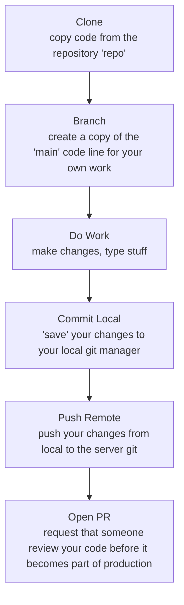

One of the most foundational things someone can learn in software development is source control, and only slightly above that, is working in source control with _other people_. This is something you may or may not have learned in college, or a boot camp style learning program. It's probable that as time goes on, this kind of thing becomes far more critical to course work, but when I was learning, I had no idea what source control was. Then, my first professional experience was with [MS Visual Source Safe](https://en.wikipedia.org/wiki/Microsoft_Visual_SourceSafe) (discontinued in 2005 -- and this was in 2010 :/ ). 

I may or may not have another blog on the details of source control, but here is a TLDR:
- Source control is used to keep a history of changes to code or files
  - This is important for bug reports, _when_ something changed, context for _why_ it changed, and _who_ changed it
- It is primarily server-client driven, meaning, the "main" copy of the code lives on a server somewhere, and when you need to work on it, you make a copy on your local PC
  - That way, if your local PC breaks down, or you accidentally delete something you didn't mean to, there is always a backup

  

So with that out of the way, let's learn one of the most critical things you can do with source control -- making a change, and having others review it (then eventually making it part of the live code). This process has a few names, but the primary two are "PR's" and "Diff's". 'PR' stands for Pull Request, and 'Diff' is short for 'difference', and refers to the difference between two files or versions (the primary reason of source control). PR is far more universal, so let's stick with that short hand for the purpose of this tutorial.

Setting the scene: you find yourself reading a friend's cool blog. You spot a typo or bad CSS  and want to give them a hand without needing to wake them up. You think: "hey I know a little about coding, maybe I can do something!". Sometimes, someone's web site may be under source control and available to collaborate on ([like this site!](https://github.com/cageymage/PersonalSite)). 

First things first, lets assume you are starting from scratch but know how to install stuff-- I won't go over an entire guide, but here's what you would need installed for almost any coding collaboration (the ones linked are what you would use to collaborate on THIS codebase)
- Some kind of IDE (Integrated Development Environment) -- like [VSCode](https://code.visualstudio.com/), Visual Studio, Eclipse -- or even just a text editor like Vim.
- [Git tools](https://git-scm.com/install/)
- Some kind of run time like [Node.js](https://nodejs.org/en), Python, .NET, etc
  - You will likely need to install tools for whatever technology the website is in too -- this one is in Astro, and the readme at root tells you how to. 
- A [github account](https://github.com/) plus some way to authenticate to github from your local machine
  - On windows, you can use Git Credential Manager (bundled with the windows git install) -- it should just prompt you to authenticate in a browser any time you try to push/pull
  - You may also need access to a repo, but mine is public

After that's all settled you'll need to grab the code from my repo, to bring down and work on. Traditionally, the process looks like this:

There are multiple ways to achieve each step. Some people (myself included) just use the UI tooling in whatever IDE they're using. I'm not that cool, so I rarely use the command line / terminal. Lets assume you are using VSCode and have installed git tools: Firstly, click on the Source Control option in the left panel (or Ctrl+Shift+G). Mouse over the "Changes" section, and click the triple dots and select Clone -- you'll get a prompt from VSCode for a url -- copy+paste the url of your target repo in there (for this site, it would be "https://github.com/cageymage/PersonalSite"). That will pull the code down onto your local PC, and ask you for the directory you want to put it in (it may also default, depending on how VSCode is configured). It should default to the `main` branch / "trunk" -- this is traditionally the mainline branch for production code. In the past, this was called `master` but that has term has been  deprecated in favor of `main`.
- Alternatively, if you are a terminal nerd, CD to where you want to put the new directory and run  
  `git clone https://github.com/cageymage/PersonalSite`

Then, you have two options -- start making your changes, or "branch" first. My repo will only accept changes to the site from a branch PR, not making changes to main directly. This is a very common practice in the engineering world. You can click the same three dot option and select Branch --> Create Branch to do this is in the GUI
- Or in the terminal `git branch -c feature-name` where feature-name is whatever short hand you'd like to call your branch when viewing or referring to it later. 

The reason I mentioned you can just start making changes is that git is pretty versatile -- it doesn't care what my repo rules are on your local machine. You can always "create a branch" from the changeset you are making as well. I traditionally create my branches ahead of time so I can name them properly and intentionally. 

Once you are done making your changes, you test them locally. Seriously, even if its just a text change, test it. I can't stress this enough. I don't have any automated tests in this repo at the moment, since it's primarily a blog / static content site and not functional. But those are also important. To run this website locally, its extremely easy (it will differ between website SDKs / tools) -- in the terminal `npm run dev`, that's it. It will likely spin up the site on port 4321, so your final URL will be something like `http://localhost:4321/`. You can view your changes in the same tab as cloning/branching -- if you see a list of files, that's how you know you have changes! Clicking on them will also allow you to view the "differences" between them -- a very valuable tool.

When you are satisfied you haven't borked anything, its time to `commit` your changes to your local git (also done in the Source Control tab, its a big blue "Commit" button). This saves it as a historical changeset within your local git install, so as long as you don't delete the whole repo directory or format C, you'll have a copy you can revert to. When you would like to commit your changes to the server (which is the whole point of this exercise), you can do the same thing except what you want to do is `push` your changes. 
- In the terminal, `git commit -m message` where message is your commit message. don't omit this. 
- Then, `git push -u origin feature-name` for a first time / new branch push, then `git push` for each subsequent push

Now comes the fun part -- putting your changes out there for someone else to review. 
- !! This is the part where I need to stress humility as an software developer trait. Feedback is NOT a personal attack. A lot of times the person reviewing your code may be a more senior developer, they are trying to help you get better, NOT tear you down like a faded glory Texas football coach. Sometimes the person reviewing your code may be junior to you, also accept the feedback with grace. It's common to learn from more junior people because they don't have years of habits built up. !!

Anyways, after you have pushed to Github, go to the site and you should have a little popup that says "feature-name branch was pushed Xs ago" and a button that creates a Pull Request -- do that. It will have a title and description for you to fill out, and show a list of changes side by side (which should look familiar at this point). Once its created, you can assign someone to it, or just message the person you want to look at it with a link to the PR (something like https://github.com/cageymage/PersonalSite/pull/PR_AUTO_NUMBER). Once they Approve it (perhaps offering change feedback as well), it will merge into main, and automation will kick off and deploy the changes to the live site!